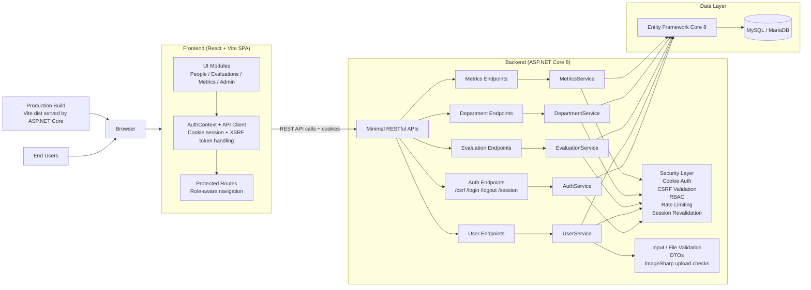

# Architecture Diagram

```mermaid
flowchart LR
    U["End Users"] --> B["Browser"]

    subgraph FE["Frontend (React + Vite SPA)"]
        UI["UI Modules
People / Evaluations / Metrics / Admin"]
        AUTH["AuthContext + API Client
Cookie session + XSRF token handling"]
        ROUTES["Protected Routes
Role-aware navigation"]
        UI --> AUTH
        AUTH --> ROUTES
    end

    subgraph BE["Backend (ASP.NET Core 8)"]
        API["Minimal RESTful APIs"]
        AUTH_EP["Auth Endpoints
/csrf /login /logout /session"]
        USER_EP["User Endpoints"]
        EVAL_EP["Evaluation Endpoints"]
        DEP_EP["Department Endpoints"]
        METRICS_EP["Metrics Endpoints"]

        AUTH_SVC["AuthService"]
        USER_SVC["UserService"]
        EVAL_SVC["EvaluationService"]
        DEP_SVC["DepartmentService"]
        METRICS_SVC["MetricsService"]

        SECURITY["Security Layer
Cookie Auth
CSRF Validation
RBAC
Rate Limiting
Session Revalidation"]
        VALIDATION["Input / File Validation
DTOs
ImageSharp upload checks"]
    end

    subgraph DATA["Data Layer"]
        EF["Entity Framework Core 8"]
        DB[("MySQL / MariaDB")]
    end

    B --> FE
    FE -->|"REST API calls + cookies"| API

    API --> AUTH_EP
    API --> USER_EP
    API --> EVAL_EP
    API --> DEP_EP
    API --> METRICS_EP

    AUTH_EP --> AUTH_SVC
    USER_EP --> USER_SVC
    EVAL_EP --> EVAL_SVC
    DEP_EP --> DEP_SVC
    METRICS_EP --> METRICS_SVC

    AUTH_SVC --> SECURITY
    USER_SVC --> SECURITY
    EVAL_SVC --> SECURITY
    DEP_SVC --> SECURITY
    METRICS_SVC --> SECURITY

    USER_SVC --> VALIDATION

    AUTH_SVC --> EF
    USER_SVC --> EF
    EVAL_SVC --> EF
    DEP_SVC --> EF
    METRICS_SVC --> EF

    EF --> DB

    BUILD["Production Build
Vite dist served by ASP.NET Core"] --> B
```
